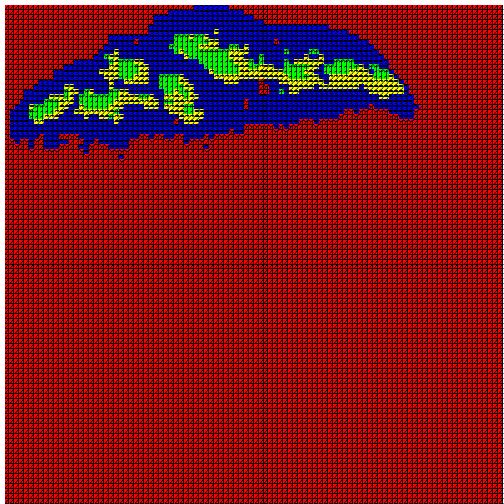

<<<<<<< HEAD
## Introduction2

Abstract

In biological systems, the correct organization and abundance of distinct cell types is important for optimal organ performance.  Identifying recurrent or cryptic cellular patterns could help us to better understand healthy functional organ states and how dysfunctional organ cellular equilibrium is altered.  However, the ability to qualitatively identify patterns among multiple cell types within an organ has provided a significant barrier to better understanding organ behavior. Here we have developed  novel molecular and computational approaches to better understand the "biogeography" of the thymus by using location and abundance information for different cell types. We used this approach to produce a thymic "map", which can be further analyzed through the use of ecological approaches in order to better understand thymic spatial patterns.  By comparing cell types within the thymus to species within an ecosystem, quantitative theoretical approaches used in ecology can be directly applied to determine spatial relationships within the thymus.  We will produce a thymic map to be used as a baseline comparative model to better understand the compositional and aggregational characteristics of a steady-state adult mouse thymus. This model can be used to make informative comparisons of thymic tissues under different developmental, mutant, or disease conditions. 
 
=======
## Introduction
>>>>>>> origin/master

Within the field of organ biology, there is a distinct lack of quantitative methods for analyzing the organization, as opposed to the composition, of organs, tissues, and cells.  Without quantitative methods for assessing organization, a significant aspect of organ and tissue biology is inaccessible to analysis and contrast.  Fortunately, a striking comparison can be drawn between the interactions that occur within organs and those that occur within ecosystems.  For instance, cell types in an organ, like species in an ecosystem, are influenced by the availability of space and resources as well as by the presence of other cell types/species. The presence or absence of one type may alter the functional role and dominance of another, or the overall service the community provides to the larger system [e.g., @wootton05].  By comparing cell types within a biological organ to species in an ecosystem, quantitative methods used for ecological analyses can be directly applied. Through analysis of the exact spatial location and co-location of component cell types, in an approach that uses the analytical toolkit of community ecologists and biogeographers, we gain a better understanding of which interactions can be validated by independent approach and analysis, as well as which interactions or even cell types we are likely to be need more information about.  

The co-distribution of constituent species in a community is often used to indicate interaction - whether competitive, trophic, or facilitative [@verberk11;@angel11]. By analyzing the exact spatial location and co-location of component cell types across the domain of a particular tissue or organ, we may gain a better understanding of which interactions - indicated by codistribution and sufficient density - can be validated by independent approach and analysis.  To an extent, we recapitulate the spatial scales described above: we explore the differentiation of distinct habitats within the environment (biogeography: identifying regions of endemicity or dramatically shifted abundance), the colocalization of particular sub-groups of cells (community ecology), and we use the tenets of macroecology to the extent that we can generalize that cells need a particular density to be viable interactors, and to the extent that common cells have a larger overall distribution (this is not tautological, this follows from the first: you cannot be rare and widespread in a functional sense).  Our overall goal is development of a cellular ecology, where we can understand interactions at a quantitative level that does not yet exist in developmental biology, particularly in this system.  We seek to create a map of a healthy adult organ using cell location and abundance, and then to spatially characterize the organ by applying ecological theory directly to the produced map (something that has never been done before).  The results from this analysis can be used to make comparisons with organs in states of disequilibrium, such as diseased or mutant organs, in order to see what organizational differences occur. 

 We performed this analysis on our model organ, the thymus.  The thymus was chosen because it is an intriguing example of cellular level organization, with a strong connection between organization and function.  The thymus consists of developing T cells supported by a complex cellular environment containing a variety of resident cell types, including thymic epithelial cells (TECs), dendritic cells, vasculature, and mesenchymal cells.  These cell types comprise multiple microenvironments that direct and support thymocytes to develop from immature progenitors into mature T cells that are both self-tolerant and self-restricted.  T cell development in the thymus requires interactions with the thymic microenvironments that provide signals for their survival, proliferation, and differentiation [1].  Despite their critical role in the generation of cellular immunity and the clinical importance of thymic regeneration, the composition and organization of thymic microenvironments and the mechanisms that promote their proper development and function are not fully understood, in part due to a lack of technical and theoretical approaches for quantifying tissue-level properties.  Thus, the thymus has many characteristics that make it an excellent system for developing and testing quantitative modeling: a diverse cellular composition that can be identified with cell type-specific markers, regional organization that is required for maximal organ function,  genetic models with diverse effects on organ composition and function, assays for experimentally inducing organ degeneration and regeneration, and high biomedical relevance.  
 
To date, there are no quantitative models of thymus organ structure and function and no established methods for generating one.  We seek to develop a quantitative theoretical model of the organization of cell types that can be used to better understand thymic function as well as evaluate diseased states. Our approach uses immunostaining on sagittal serial sections of a wildtype mouse thymus in order to identify distinct cellular subsets, followed by the use of novel computational approaches in order to quantitatively identify known and cryptic cellular spatial relationships.  First, we used the K means clustering algorithm to identify geographical clusters of cell types based on compositional similarities and abundance [CITE?]. We used a range of K values to compare to previously identified regions of the thymus and to identify cryptic organization. We then used the Bray Curtis Dissimilarity Index to determine the degree of similarity between clusters produced from K means clustering [CITE]. The value produced can also be used for comparisons between different sections, different samples, and can also be compared to ecosystems. We then take this approach one step further by applying these same approaches to a mutant (Aire knockout) mouse thymus to determine if there are differences in organization compared to the wildtype. The Aire knockout mutant was selected in order to test whether dendritic organization is altered with the removal of Aire (as well as doubling of K14?); there are differing reports in the literature [CITE].
 
 Cell Types Used in Analysis
 SHOULD I INCLUDE PARAFFIN ANTIBODIES?
 ----------- ---------- -------------------------
  cTEC       CD205     

  mTEC       UEA1, Claudin3
             Claudin4, K14
             K5  
              
  Blood vessel PDGFRb, Claudin5, CD31 
  
  Dendritic  CD11c
  
  Tcells     Foxp3, CD25  
                                       
----------- ---------- -------------------------
 
### Hypotheses

I predict that the distribution and abundance of cell types is sufficient for automated clustering of thymic regions.  The organization of a wild-type, mature thymus will either organize into more discrete regions than a mutant thymus, or the regionalization will be more variable and less discrete.
Next, we will examine cellular absence/presence with respect to other cell types to see if any patterns emerge
By using a well characterized dissimilarity index (Bray Curtis Dissimilarity Index), we will determine the degree of similarity between different regions and subregions.
We will apply the above approaches to a mutant thymus in order to see if orgazinational differences can be detected.

 
## Methods

### Terminology

I suggest an explanatory box for readers so that quadrat, section, composite, etc. can all be explained clearly in one place.

----------- ---------- -------------------------
  quadrat    spatial     sampled unit within
                          domain; cell types in
                          quadrats used to find
                          regions of similar
                          composition

  transect    spatial     linear array of 
                          sampled units 
                          (quadrats), may be
                          comprehensively or
                          randomly sampled
                          
  layer      tissue       actual tissue sample
                          used to assay 
                          single-cell thickness
                          composition
----------- ---------- -------------------------

### System and Data Collection

#### Mice
C57BL/6 male mice (N=4) at 5-6 weeks of age were purchased from Jackson Laboratories (Bar Harbor, Maine). Aire knockout (N=2) and WT male (N=2) mice at 5-6 weeks of age were obtained from Dr. Mark Anderson's lab at the University of California, San Francisco.

#### Tissue Preparation

Intact thymuses were removed and the right and left lobes were separated, placed in OCT compound, and immediately frozen before being shipped to the Manley lab.

#### Antibodies

Primary antibodies used in this work include the biotinylated hamster CD11c (Cat#, 1:100), rabbit Claudin 3 (Cat#:  , 1:200), rabbit Claudin 4 (Cat#: , 1:200), supernatant hamster CD31 (Cat#, 1:50), rat CD25 (Cat#: , 1:50), biotinylated UEA1 (Cat#: , 1:200), conjugated mouse Claudin5 (Cat#: , 1:100), rabbit Keratin5 (Cat#, 1:200), biotin rat Foxp3 (Cat#, 1:50), goat Keratin14 (Cat#, 1:200), goat PDGFRb (Cat#, 1:100), and rat CD205 (Cat#, 1:200). 
Secondary antibodies were purchased from Invitrogen.
 
#### Frozen Sample Preparation
The entire left lobe was cut into 10-micron serial sagittal sections using a Leica CM3050 S cryostat. Sections were collected on glass slides and assigned a number corresponding to their location.  The middle third of these slides were selected for IHC.  Of these middle third, 9 sections from each sample that passed quality control standards were used for IHC.  These sections were fixed in -20 degree C acetone for 20 seconds immediately prior to application of blocking solution (10% donkey serum/PBS) for 30 minutes at room temperature.

#### IHC
Primary antibodies were mixed in PBS and incubated overnight at 4C.  The slides were rinsed with PBS 2x 5 minutes and the secondary antibodies were mixed in PBS (1:800) and applied to the slides for 30 minutes.  Slides were rinsed with PBS 2x5 minutes, mounted in FluorGel (EMS) and coverslipped.   Marker combinations were determined by availability,  biological and technical considerations such as anticipated abundance, distribution of cell types, and reagent compatibility (antibody species of origin). 

#### Microscopy, PTGui, and CellProfiler
The stained sections were assessed by specific quality control criteria such as lack of section flaws, clarity of image collection, and signal to noise ration.  Sections that passed the QC measures  were photographed at 20x as tiled, overlapping images  on the Zeiss  microscope and reconstructed using PTGui.  The image produced was optimized in Adobe Photoshop in an effort to reduce background and increase signal intensity.  The produced image was too large to work in CellProfiler, so the size of the image was decreased by taking the image width and dividing by 4.  CellProfiler was used to generate cell counts using intensity of signal and the results were input into R for the spatial analysis.  CellProfiler was chosen because it had the capability of quickly, accurately, and efficiently producing cell count number as well as position information  (x and y, centroid) for a large number of cells.  Results from the cell counts were  manually checked for accuracy.  CellProfiler uploaded the image, cropped the image around the section boarder (this was done by drawing a line around the section boarder), identified primary objects, and exported the primary objects in an excel file as x and y coordinates. 

####R
Files containing the X and Y coordinates from CellProfiler were uploaded into R and reformatted into a community matrix.  The K-means function in R's stats package was used to cluster the data. The  Bray-Curtis function in the Vegan package was used to calculate the Bray-Curtis index for the different regions produced from K-means clustering.  


   
### Identification of Scale

As thymic epithelial cells vary in size from X to X', we considered the problem of how to generate sampled regions (quadrats) that contained sufficient information about the local community of cells that these regions could be classified. In other words, we need to have lots of data in each quadrat to have statistical power for clustering; we need lots of quadrats to improve the spatial resolution. Identifying the best scale is done how?

5. Quadrat Selection and Rarefaction: you need to explain how you did this, and the next chunk can include the code you used to achieve this. That way, our results can include one plot and a brief discussion about the selection of that size quadrat and what it means for inclusion of cell types in a given quadrat


```
## Error: cannot open the connection
```


6. Now get into the methods you already have in your R script, first setting K=2 and removing all quadrats that fall outside of the thymus from further analysis. You can do this using the subset command I think. We can then talk about more ways to maintain the identity of a given cluster of spatial quadrats (identity being the type of mouse, the section of thymus, and so on)


```
## Error: object 'result0' not found
```

```
## Error: object 'result1' not found
```

```
## Error: object 'result2' not found
```

```
## Error: object 'result3' not found
```

```
## Error: object 'spe.kmeans_Mutant1_All' not found
```

```
## Error: object 'spe.kmeans_Mutant1_S1' not found
```

```
## Error: object 'spe.kmeans_Mutant1_S2' not found
```

```
## Error: object 'spe.kmeans_Mutant1_S3' not found
```

 


Next Step: Figuring out how clustering is done
We can see that we've asked R to take cell count info from 11 cell types and make 4 clusters


#need automatic way to identify _empty_ outside of thymus


```
## Error: object 'spe.kmeans_Mutant1_All' not found
```


Looking at cellular relationships between clusters
We can make a running sum of all the counts of all cell types by cluster
By this point we need to have excluded the blank space!!!


```
## Error: object 'result0' not found
```

```
## Error: object 'result0' not found
```

```
## Error: object 'result0' not found
```

```
## Error: object 'b2' not found
```

```
## Error: object 'b3' not found
```

```
## Error: object 'b4' not found
```

```
## Error: object 'b2' not found
```

```
## Error: object 'b2' not found
```

```
## Error: object 'b3' not found
```


6b. bray curtis

6c. significant diffs between cell types?

7. also Andrew Sornborger's approach for separating out the geometry/geography of clusters., and/or using connected component labeling to identify size, centroid, distance of centroids among clusters

8. jackknifing : removing one cell type at a time

The way to read the last plots is for something like "2-3", positive bars mean that cell type is more common in cluster 2 (than 3); negative bars mean the opposite. The higher the absolute number on the y-axis, the greater the difference is in that cell count between the two clusters. I think (as John suggested), that we can move ahead and be more formal with this analysis (e.g. Bray Curtis dissimilarity), but this is a useful first step.

## Bray Curtis

In R, the analogy to re-oarganizing data by either pivot tables, or manual calculation and pasting into a new sheet, is to manipulate one data frame to another. The 'dplyr' package or the 'aggregate' function can both help you here. For most standard ecology metrics there are usually one or more packages that make our life easier. Here the 'vegan' package is useful. In this example, we work out Bray-Curtis for all clusters (pairwise comparison)

df<-NULL
df2<-NULL
#these nulls are here to reset the dataframes from the rbind that is below, only important if iteratign across commands outside of KNITR


```
Error: there is no package called 'dplyr'
```

```
Error: could not find function "%>%"
```

```
Error: could not find function "%>%"
```

```
Error: could not find function "%>%"
```

```
Error: object 'df2' not found
```

```
Error: object 'dfTOTAL' not found
```

```
Error: object 'BrayCurtis' not found
```

```
Error: object 'hc' not found
```


# Results

1. How many mice of each type, how many replicates of mouse x thymus x prep method. 
2. Size of quadrat selected, and what this says about number of individual quadrats examined, number of total cell counts. People love those sorts of numbers!
3. Clustering and K selection
4. Using BC to validate how different clusters are, importance of composite versus individual layers.
5. Geography: Sornborger
6. etc.

# Discussion

To an extent, as K goes up it may be that spatial weighting is important, but we choose to avoid the problems that weighting brings up; it may also be possible that some of the areas defined as K approaches 10+ are legitimate microenvironments and this will be addressed in a later paper.

1. I can generate a map of the thymus that supports previous discussion of the geography of the thymus, but it is automatic and dependent on objective criteria of sorting the functional cell types in a spatially explicit way.
2. We believe we have identified subregions in the medulla. This is cool.
3. Though our replication is minimal, we can say that there is/is not quantifiable distinction between the spatial organization of WT and Aire- mice. This has been debated in the literature and we resolve it.
4. There is much more we can do with this approach. 
5. Ecologically, it is unusual to have the problem of such complete sampling of an ecosystem. Our approach to sampling this has strengths and concerns, generally associated with K-means clustering which has its subjective/ambiguous problems but is the best we can do!


Why this approach is novel 
Coolest thing we found, how to explain it
If we did not find a big shift in organization between treatment, it is probably because what was turned off in mutant was not a 'foundational species' in this system (see http://bioscience.oxfordjournals.org/content/61/10/782.full ) as such is a minor perturbation for organization of system, even if ecosystem service ie functionality of thymus is affected. We have to separate these effects after all! It is also important to note that the cell types are not independent arrivals in the thymic ecosystem. As a developmental process, the analogy is not complete: this would be like a coral reef developing with functionally distinct polyps spatially arranged to improve net fitness (i.e. reproductive capacity); this of course does happen in certain colonial species (hydrozoans for example) and as such this may generate its own numerical/mathematical patterns distinct from the standards of community ecology (e.g. species-area hypothesis).
Second coolest thing
Concern we would like to address

Next step for application of this approach - also bigger picture stuff.
Comparison - a manipulated salt marsh ecosystem and how B-C was used to compare treatment and sites
http://www.mass.gov/eea/docs/czm/habitat/wetlands/cape-cod-report-v2.pdf
another
http://books.google.com/books?id=Kpi9TjDQO8QC&pg=PA28&lpg=PA28&dq=bray-curtis+salt+marsh&source=bl&ots=iiISZsY9Jf&sig=YGSLp0cG06oKxB1Ung56AS2EQgw&hl=en&sa=X&ei=M44yVP-_CYylyASMioLgCQ&ved=0CDgQ6AEwAw#v=onepage&q=bray-curtis%20salt%20marsh&f=false
useful comparison because of similar taxonomic diveristy (?)
http://www.scielo.br/scielo.php?pid=S1516-89132009000600013&script=sci_arttext

http://www.researchgate.net/publication/259146839_Dissimilarity_in_plant_species_diversity_between_salt_marsh_and_neighboring_environments_decreases_as_environmental_harshness_increases

http://www.tandfonline.com/doi/full/10.1080/19425120.2014.893467#.VDKQQkuoVss
there are many more. we can learn from the methods..

# Literature Cited

